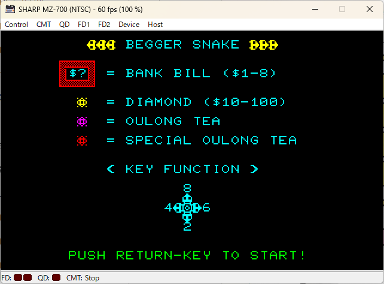
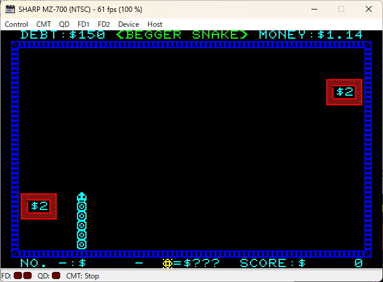
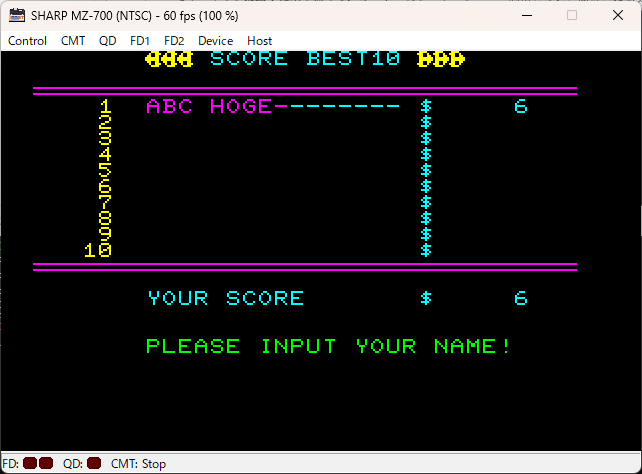

# BEGGAR SNAKE MZ-700 パッチ

## はじめに

工学社の雑誌 I/O 1982年6月号掲載の相良宏重氏の BEGGAR SNAKE を MZ-700 で動作させるためのパッチです。

| タイトル画面       | ゲーム画面           | ベスト10画面 |
| --                 | --                   | --           |
| | ||

## 実行環境

- MZ-700
- PCG-700

※ 動作確認はエミュレータのみ。

## ビルド

### 必要なもの

- [AILZ80ASM](https://github.com/AILight/AILZ80ASM)
    - AILight（Mitsuhito Ishino）氏作成の Z80 アセンブラです。
- BEGGAR SNAKE プログラム
    - 雑誌 I/O 1982年6月にチェックサム付き16進ダンプリストで掲載されたものです。
    - machine.bin というファイル名で保存してください。

### ビルド方法

- build.cmd を実行します。
- AILZ80ASM の出力形式として mzt を指定していますが、2025年3月3日現在は利用できませんので、次のいずれかの方法で実行環境にあったファイルとしてください。
1. bin, cmt 等の形式を指定して出力した後に、mzt に変換する。
2. AILZ80ASM が対応するまで待ってからビルドする（※）。
3. fork リポジトリ [https://github.com/dogatana/AILZ80ASM](https://github.com/dogatana/AILZ80ASM) の output-mzt ブランチからビルドした AILZ80ASM を使用して mzt 形式を出力する。

__※__ pull request を発行していますが、採用されるかどうかを含め対応時期は未確定です。

## 利用方法

- PCG-700 を利用する設定とします。
- アドレス $1200 から起動します。
- タイトル画面で操作可能なキーは次のとおりです。
    - M / Enter ・・ ゲーム開始
    - C ・・ モニタへ戻る
    - E ・・ ベスト10スコアの消去
- ゲーム画面で 2 / 4 / 6 / 8 の他、カーソル移動キーで移動方向を指定可能です。
- ゲームオーバ時、スコアがベスト10内の場合、名前を入力可能です。
    - 英数字、スペース、いくつかの記号が入力可能です。
    - ← キーでカーソルを左に移動できます。
    - 最大文字数入力するか、Enter キーで "PUSH RETURN-KEY TO START!" と表示され、次のキーを入力可能です。
        - M / Enter ・・ ゲーム開始
        - C ・・ モニタへ戻る
        - E ・・ ベスト10スコアの消去
        - B ・・ タイトル画面の表示

## カスタマイズ

- I/O の記事 『表1 ゲームの変更点』にあるアドレスはプログラムが $DA00 から配置される前提で記載されていますが、 MZ-700 用に $2310 からにリロケートしています。それを考慮して次のような方法でカスタマイズしてください。
    - モニタから直接修正する。
    - エミュレータのデバッグ機能で修正する。
    - patch_data.inc を追加・修正し、再度ビルドする。
- pathc_data.inc で蛇の速さを 2行目で修正済みです。(動作させてみたところ、当時はこんなに速くはなかった記憶があったため、遅めに変更)

## 謝辞

- 本パッチ作成にあたり次のサイトを参考にさせていただきました。有用な情報を提供してくださった各位に感謝します。
    - [AKD's site](http://mzakd.cool.coocan.jp/) 
    - [We Love MZ-700](http://www.maroon.dti.ne.jp/youkan/mz700/index.html)
    - [PC-8801覚え書き](http://www.maroon.dti.ne.jp/youkan/pc88/index.html)
    - [PCG8100 から発音させる：プログラミング指南](https://codeknowledge.livedoor.blog/archives/12640499.html)